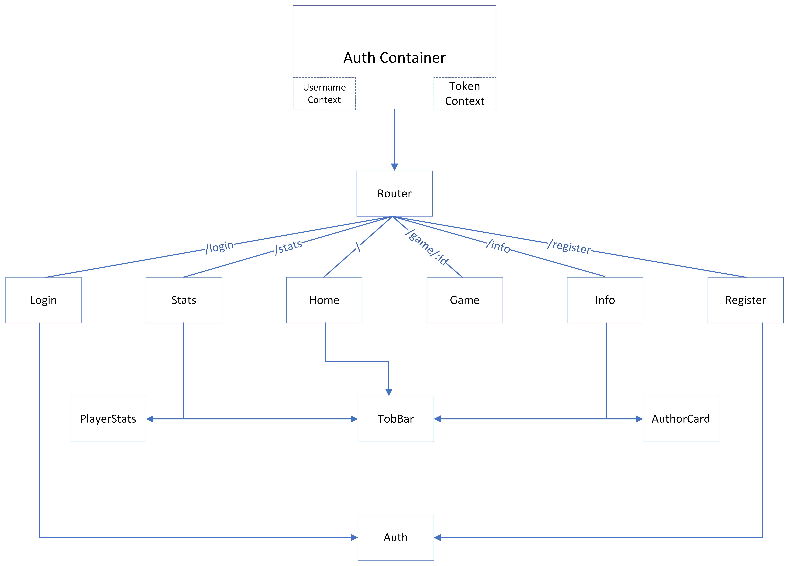
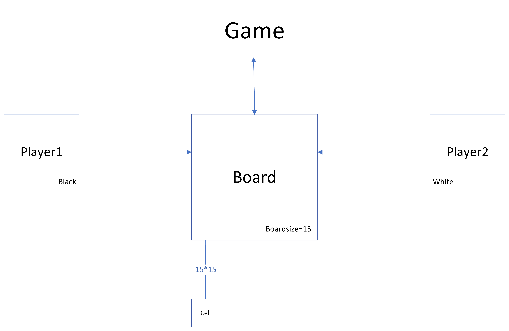

# Relatório Técnico

## Introdução

A Segunda fase deste projecto consistiu no desenvolvimento e uma _client-side application_ que faz uso da API implementada na fase anterior em que ,usando os dados recebidos através da API, a aplicação _front-end_ desenha uma UI que torna possivel o utilizador interagir com o jogo desenvolvido.

## Organização do Software

A Aplicação usa como mecanismo de autenticação de jogadores o **AuthContainer**, este é um componente que contém o _Access Token_ e _Username_ num hook **UseContext()**, estes depois podem ser usados por todas as _children_ de **AuthContainer**, que são todos os componentes renderizados pelo **ReactRouter**

Autenticação do Utilizador é necessaria para a maioria dos recursos da aplicação, depois de registado e _Logged In_, o _Access Token_ e _username_ do utilizador são guardadas pelo **AuthContainer** como _context_ para depois serem acedidos pelos seus componentes _children_ para verificar se o utilizador esta autenticado ou não.

O Jogo em si é por uma _Board_ de dimensões variáveis composta por cells na qual dois jogadores jogam por turnos.

Após receber os dados da _Back-end_, o componente game faz diversas operações para determinar que dados pertencem a que jogador e que cor que cada jogador vai jogar e consequentemente as regras a que terá de obedecer